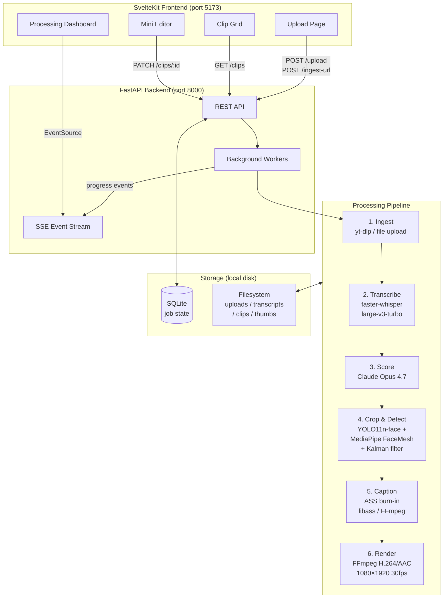

# ShortSmith — Implementation Plan

_Self-Hosted Opus Clips Replacement for YouTube Shorts_

---

## Architecture Overview



---

## Technology Stack

| Layer | Technology | Version | Justification |
|-------|-----------|---------|---------------|
| Backend | FastAPI + Uvicorn | latest | Async-native, SSE support built-in, easy background tasks |
| Database | SQLite + SQLModel | latest | Zero-infrastructure; sufficient for single-user |
| Frontend | **SvelteKit** | latest | SSE via `EventSource` is trivial; reactive stores make per-clip progress state elegant; 40KB runtime vs React's 130KB; no `use client`/`use server` friction |
| Transcription | faster-whisper | 1.2.1 | Word-level timestamps, GPU/CPU auto-detect |
| LLM | Anthropic SDK + claude-opus-4-7 | 0.101.0 | Structured output via `response_format` + Pydantic |
| Face Detection | ultralytics YOLO11n-face | latest | Best multi-face accuracy in 2026 (WIDERFACE Hard AP: 0.810) |
| Lip Tracking | mediapipe FaceMesh (Tasks API) | 0.10.35 | 478-point landmarks, pip-installable |
| Smoothing | filterpy Kalman | latest | No rubber-banding; handles missed detections gracefully |
| Video Processing | python-ffmpeg | latest | Actively maintained; `ffmpeg-python` abandoned + FFmpeg 7.x incompatible |
| Download | yt-dlp | 2026.3.17 | Progress hooks, best format selection |

---

## Directory Structure

```
shortsmith/
├── backend/
│   ├── main.py                  # FastAPI app, CORS, routers
│   ├── config.py                # All paths, model names, defaults
│   ├── database.py              # SQLite engine + SQLModel session
│   ├── models.py                # Job, Clip, Word SQLModel schemas
│   ├── routers/
│   │   ├── upload.py            # POST /upload, POST /ingest-url
│   │   ├── jobs.py              # GET /jobs/{id}, GET /jobs/{id}/stream (SSE)
│   │   └── clips.py             # GET/PATCH /clips, POST /clips/{id}/rerender
│   ├── services/
│   │   ├── ingest.py            # yt-dlp wrapper
│   │   ├── transcribe.py        # faster-whisper, cache, whisperX opt-in
│   │   ├── score.py             # Claude scoring + Pydantic schemas
│   │   ├── detect.py            # YOLO11n-face + FaceMesh + Kalman
│   │   ├── captions.py          # ASS file generation
│   │   └── render.py            # FFmpeg pipeline: crop + caption + encode
│   └── workers.py               # Pipeline orchestration + per-clip error isolation
├── frontend/
│   ├── src/
│   │   ├── routes/
│   │   │   ├── +page.svelte          # Upload / home
│   │   │   ├── jobs/[id]/+page.svelte # Processing dashboard (SSE progress)
│   │   │   └── clips/+page.svelte    # Clip grid + mini editor
│   │   ├── lib/
│   │   │   ├── components/
│   │   │   │   ├── UploadZone.svelte
│   │   │   │   ├── ProgressDashboard.svelte
│   │   │   │   ├── ClipCard.svelte
│   │   │   │   └── MiniEditor.svelte
│   │   │   ├── api.ts            # Typed API client
│   │   │   └── stores.ts         # Job/clip reactive stores
│   │   └── app.css               # Tailwind base
│   ├── svelte.config.js
│   ├── vite.config.js
│   └── package.json
├── docs/
│   └── research-notes.md
├── scripts/
│   └── poc_crop_caption.py       # Vertical slice POC (run before building UI)
├── caption_config.json           # Configurable styling
├── .env.example
├── PLAN.md
├── README.md
└── Makefile
```

---

## caption_config.json Schema

```json
{
  "font_family": "Arial Black",
  "font_size": 90,
  "primary_color": "#FFFFFF",
  "highlight_color": "#FFFF00",
  "outline_color": "#000000",
  "outline_width": 3,
  "shadow_alpha": 0.5,
  "shadow_offset": 1.5,
  "position_y_ratio": 0.65,
  "max_words_per_line": 2,
  "safe_margin_bottom_px": 450
}
```

---

## Data Models

### Job
```
id: UUID
status: pending | ingesting | transcribing | scoring | rendering | done | failed
source_type: upload | youtube_url
source_ref: str (filename or URL)
video_path: str
transcript_path: str (JSON cache)
created_at: datetime
updated_at: datetime
error: str | null
progress_pct: float
progress_stage: str
```

### Clip
```
id: UUID
job_id: UUID (FK)
start: float (seconds)
end: float (seconds)
score: int (1-100)
title: str
hook_line: str
why_it_works: str
suggested_hashtags: list[str]
dimension_scores: JSON (7-dimension breakdown)
output_path: str | null
thumbnail_path: str | null
status: pending | rendering | done | failed
error: str | null
```

### Word (transcript cache)
```
id: int
job_id: UUID (FK)
start: float
end: float
word: str
segment_id: int
```

---

## Atomic Task Breakdown

### Phase 1: Research & Planning ✓
- [x] Parallel research on 4 topics (agents)
- [x] Write docs/research-notes.md
- [x] Write PLAN.md + propose Claude prompt

### Phase 2: Vertical Slice POC
- [ ] `scripts/poc_crop_caption.py` — hardcoded sample video → face detect → crop → ASS captions → 30s output
- [ ] Extract 3 frames as PNG to verify crop smoothness
- [ ] Iterate until output is clean

### Phase 3: Backend Scaffold
- [ ] `pyproject.toml` with all dependencies pinned
- [ ] `backend/config.py` — all paths, env vars, model names
- [ ] `backend/database.py` — SQLite engine, session factory
- [ ] `backend/models.py` — Job, Clip, Word SQLModel
- [ ] `backend/main.py` — FastAPI app, CORS, mount routers

### Phase 4: Ingestion Service
- [ ] `backend/services/ingest.py` — yt-dlp download with progress hook → asyncio queue
- [ ] `backend/routers/upload.py` — POST /upload (multipart, chunked), POST /ingest-url
- [ ] File validation: mime type, size sanity check

### Phase 5: Transcription Service
- [ ] `backend/services/transcribe.py`
  - [ ] GPU/CPU auto-detect with warning log
  - [ ] faster-whisper transcribe with `word_timestamps=True`
  - [ ] Cache transcript as `{video_hash}.json` in `data/transcripts/`
  - [ ] Return `List[Word]` with start/end/text

### Phase 6: Claude Scoring Service
- [ ] `backend/services/score.py`
  - [ ] Semantic chunking: split transcript at sentence boundaries into 30-90s windows
  - [ ] Build scoring prompt (template below)
  - [ ] `client.messages.parse()` with Pydantic `ClipCandidate` schema
  - [ ] Retry on rate limit (exponential backoff)
  - [ ] Store candidates as Clip rows in DB

### Phase 7: Face Detection & Crop
- [ ] `backend/services/detect.py`
  - [ ] YOLO11n-face: load model, detect faces per-frame (every Nth frame, interpolate)
  - [ ] MediaPipe FaceMesh: lip aperture ratio for active speaker selection
  - [ ] Kalman filter on (cx, cy) of active speaker bounding box center
  - [ ] Output: `List[FrameCrop]` = (frame_idx, x, y, w, h)
  - [ ] Fall back to center crop if no face detected for >1 second

### Phase 8: ASS Caption Generation
- [ ] `backend/services/captions.py`
  - [ ] Parse `caption_config.json`
  - [ ] For each clip: filter words in [start, end] time range
  - [ ] Group into lines of ≤ max_words_per_line
  - [ ] Emit one `Dialogue` event per word: active word uses highlight color, preceding words use primary
  - [ ] `ScaledBorderAndShadow: yes` in Script Info
  - [ ] Write `.ass` file to temp dir

### Phase 9: FFmpeg Render Pipeline
- [ ] `backend/services/render.py`
  - [ ] Extract clip segment from source video
  - [ ] Apply crop filter using FrameCrop data (crop=w:h:x:y with frame interpolation)
  - [ ] Scale to 1080×1920
  - [ ] Burn ASS captions via `ass=` filter
  - [ ] Encode H.264 + AAC, 30fps
  - [ ] Hardware accel: detect nvenc (NVIDIA) or videotoolbox (macOS), fall back to libx264
  - [ ] Stream stderr for real-time progress via python-ffmpeg events
  - [ ] Generate thumbnail: extract frame at start+2s, convert to JPEG

### Phase 10: Job Orchestration
- [ ] `backend/workers.py`
  - [ ] `process_job(job_id)` — async function, runs phases 4-9 in sequence
  - [ ] Per-stage progress updates → broadcast via SSE
  - [ ] Per-clip error isolation: wrap each clip render in try/except, set clip.status="failed", continue
  - [ ] Parallel clip rendering: `asyncio.gather(*[render_clip(c) for c in clips])`

### Phase 11: SSE & Job Status API
- [ ] `backend/routers/jobs.py`
  - [ ] `GET /jobs/{id}` — current state
  - [ ] `GET /jobs/{id}/stream` — SSE: `data: {"stage": ..., "pct": ..., "clip_id": ...}`
  - [ ] In-memory asyncio queue per job for SSE events

### Phase 12: Clips API
- [ ] `backend/routers/clips.py`
  - [ ] `GET /clips?job_id=` — list clips with scores
  - [ ] `PATCH /clips/{id}` — update start/end/title
  - [ ] `POST /clips/{id}/rerender` — trigger re-render after edit
  - [ ] `GET /clips/{id}/download` — stream file response
  - [ ] `GET /jobs/{id}/download-all` — ZIP all done clips

### Phase 13: SvelteKit Frontend
- [ ] Init SvelteKit with TypeScript + Tailwind (dark mode config)
- [ ] `UploadZone.svelte` — drag-drop + URL input, validate, POST to API
- [ ] `jobs/[id]/+page.svelte` — SSE EventSource, per-stage progress bars, per-clip status
- [ ] `ClipCard.svelte` — thumbnail, score badge, title, hook line, hashtags
  - [ ] Preview (video element, autoplay muted on hover)
  - [ ] "Why it works" tooltip on hover
  - [ ] Download button, score bar
- [ ] `clips/+page.svelte` — responsive grid of ClipCards + "Download All ZIP" button
- [ ] `MiniEditor.svelte`
  - [ ] Slider for ±2s nudge on in/out points
  - [ ] Caption style selector (from preset configs)
  - [ ] "Re-crop" button → POST /clips/{id}/rerender
  - [ ] "Regenerate title" button → PATCH with new AI title

### Phase 14: Quality Pass
- [ ] Test with interview video (single presenter, talking head)
- [ ] Test with podcast/panel (2+ speakers, camera switching)
- [ ] Test with monologue (fast speech, heavy accent)
- [ ] Tune: Kalman Q/R values, whisper VAD settings, Claude prompt
- [ ] Document what was tuned and why

### Phase 15: Documentation
- [ ] README with setup, troubleshooting, architecture Mermaid
- [ ] `.env.example`
- [ ] `Makefile` with `install`, `run`, `test` targets
- [ ] Final commit + push

---

## Claude Scoring Prompt — FOR YOUR REVIEW

This is the **exact template** that will be sent to `claude-opus-4-7`. Please review and give feedback before I integrate it.

```
You are a YouTube Shorts virality analyst with expert-level knowledge of short-form
video performance data, audience psychology, and the YouTube algorithm.

Your task: evaluate timestamped transcript segments from a longer video and identify
the best candidates for standalone viral YouTube Shorts (15–60 seconds).

━━━━━━━━━━━━━━━━━━━━━━━━━━━━━━━━━━━━━
SCORING DIMENSIONS
━━━━━━━━━━━━━━━━━━━━━━━━━━━━━━━━━━━━━

Rate each candidate on these 7 dimensions (1–10 each):

1. hook_strength
   The first 3 seconds determine algorithmic fate. 30%+ drop-off at 3s = algorithm
   suppresses distribution. Score HIGH for:
   - Pattern interrupt: unexpected statement, mid-action entry, violated expectation
   - Curiosity gap: open loop that's uncomfortable to leave unresolved
   - Direct viewer address: "you", "are you", "have you ever"
   - Negative hook: "Stop doing X" / "You're doing this wrong"
   - Counter-intuitive claim that demands resolution
   Score LOW for: starting with "So", "Um", "Like", "Basically", "In this video",
   greetings, transitions ("As I was saying"), or context-setting that delays the point.

2. payoff
   Does the clip FULLY DELIVER on what the hook implied? Does it end with genuine
   resolution — a completed thought, a revealed answer, a landing? Score HIGH for clips
   that give the viewer the exact thing the opening promised. Score LOW for clips that
   trail off, require the full video for resolution, or end mid-sentence.

3. self_containment
   Can this clip stand completely alone with zero prior context? Score LOW if:
   - Pronouns without antecedents: "he said," "that's why," "after what happened"
   - Requires knowing who/what was discussed earlier
   - References "earlier in the video," "as I mentioned," "going back to"
   - Punchline or insight depends on setup that isn't in this segment
   Score HIGH if a viewer who has never seen the source video would fully understand
   and benefit from this clip.

4. emotional_peak
   Does it trigger a strong, shareable emotion? Ranked by virality yield:
   - Awe/surprise: highest share trigger (score 9-10)
   - Humor/amusement: 30% more shares than serious content (score 7-9)
   - Fear/urgency: strong retention, lower shares (score 6-8)
   - Relatability: consistent but low peak ceiling (score 5-7)
   - Neutral information delivery: low viral potential (score 1-4)

5. quotability
   Is there a single sentence someone would screenshot, tweet, or repeat to a friend?
   Score HIGH for: short (<15 words), memorable, expresses something the viewer
   couldn't have said as well themselves, or reframes something they already knew.
   Score LOW for: facts that can't be excerpted, procedural content, hedged statements.

6. retention_shape
   Does interest BUILD across the clip, or does it decay? Ideal shape:
   - Hook in first 3s → rising stakes or intrigue → peak insight/payoff at the end
   Score HIGH for: escalating reveals, building tension with resolution.
   Score LOW for: front-loaded content that trails off, filler in the middle,
   restatements of the same idea, long ramp-up before the actual point.

7. novelty
   Is this information, perspective, or delivery that surprises an average viewer?
   Score HIGH for: counterintuitive claims, violated expectations, insider information,
   format-breaking delivery, data that contradicts common belief.
   Score LOW for: restating conventional wisdom, generic advice, well-known facts.

━━━━━━━━━━━━━━━━━━━━━━━━━━━━━━━━━━━━━
ANTI-PATTERNS — DISQUALIFIERS
━━━━━━━━━━━━━━━━━━━━━━━━━━━━━━━━━━━━━

Apply heavy penalties (overall score ≤ 35) if ANY of these are present:

✗ Opens with a transition word or filler: "So,", "Um,", "Like,", "Basically,", "And,"
✗ First sentence is a greeting, intro, or housekeeping ("Welcome back", "Don't forget to subscribe")
✗ Requires the viewer to have watched the surrounding video to understand the point
✗ The clip is entirely setup with no payoff within the segment
✗ Speaker is still doing context-setting at 10+ seconds with no hook established
✗ Clip is primarily recapping something that already happened vs. delivering a live moment
✗ The only payoff is a vague summary: "And that's basically it", "Which is really interesting"
✗ Segment length exceeds 60 seconds AND content density doesn't justify it

━━━━━━━━━━━━━━━━━━━━━━━━━━━━━━━━━━━━━
FEW-SHOT EXAMPLES
━━━━━━━━━━━━━━━━━━━━━━━━━━━━━━━━━━━━━

EXAMPLE 1 — HIGH SCORE (score: 87)

Transcript segment:
[142.3 --> 174.8]
"Nobody tells you this, but the number one reason startups fail isn't running out of 
money — it's running out of courage. Money is just a symptom. I've watched founders 
quit when they had eighteen months of runway left because they stopped believing. 
That's the real clock. Not your bank account."

Scores: hook_strength=9, payoff=9, self_containment=10, emotional_peak=8,
quotability=9, retention_shape=8, novelty=8 → overall: 87

title: "The Real Reason Startups Die (It's Not Money)"
hook_line: "Nobody tells you this, but the number one reason startups fail isn't running out of money"
why_it_works: "Opens with 'nobody tells you this' — an instant credibility + curiosity gap combo. 
Delivers a counterintuitive reframe immediately (courage vs money), then crystallizes it into a 
quotable line. Fully self-contained, no context needed. The retention shape is perfect: hook → 
evidence → memorable conclusion."

---

EXAMPLE 2 — LOW SCORE (score: 22)

Transcript segment:
[87.1 --> 112.4]
"So as I was saying earlier about the marketing strategy we discussed, um, the key 
thing to understand is — and I mentioned this before — John had already done the 
analysis and what he found was, and I'll get to the numbers in a second, basically 
the conversion rates were higher. Which is what we expected. So that's pretty 
interesting if you think about it."

Scores: hook_strength=1, payoff=2, self_containment=1, emotional_peak=1,
quotability=1, retention_shape=2, novelty=1 → overall: 22

Disqualifiers triggered: opens with "So", references prior context twice, 
pronoun "he" without antecedent, no payoff, vague summary ending.

━━━━━━━━━━━━━━━━━━━━━━━━━━━━━━━━━━━━━
OUTPUT FORMAT
━━━━━━━━━━━━━━━━━━━━━━━━━━━━━━━━━━━━━

Return a JSON array. Each element:

{
  "start": <float, seconds>,
  "end": <float, seconds>,
  "score": <int, 1-100, weighted: hook_strength × 2, payoff × 2, others × 1, normalized>,
  "title": <string, under 60 chars, written as a hook/tease not a summary>,
  "hook_line": <exact quote from transcript — the strongest opening line in the segment>,
  "why_it_works": <2-3 sentences for the creator: what makes this work and what to watch for>,
  "suggested_hashtags": [<5-8 strings, no # prefix>],
  "scores": {
    "hook_strength": <1-10>,
    "payoff": <1-10>,
    "self_containment": <1-10>,
    "emotional_peak": <1-10>,
    "quotability": <1-10>,
    "retention_shape": <1-10>,
    "novelty": <1-10>
  },
  "warning": <string or null — flag any concern: "may need 2s of context before the hook">
}

Rules:
- Return 5–15 candidates ordered by score descending
- Only include clips with overall score ≥ 55
- Do NOT pad with weak clips to reach the minimum — fewer high-quality clips beats more weak ones
- Prefer 20-45 second segments over 45-60 second ones when both cover the same content
- Do not overlap segments (start time of each must be after end time of prior)
- Return JSON only — no preamble, no explanation outside the array

━━━━━━━━━━━━━━━━━━━━━━━━━━━━━━━━━━━━━
TRANSCRIPT
━━━━━━━━━━━━━━━━━━━━━━━━━━━━━━━━━━━━━

Source video: {{VIDEO_TITLE}}
Duration: {{DURATION_MINUTES}} minutes
Genre (if detectable from content): {{GENRE}}

Transcript (format: [START --> END] text):

{{TRANSCRIPT_CHUNKS}}
```

---

## Open Questions for Your Review

Before I write a line of production code, please confirm or redirect on these:

1. **Whisper model**: Research shows `large-v3-turbo` is 6x faster than `large-v3` with minor accuracy loss on English. I'll default to `large-v3-turbo` with `large-v3` as a config option. OK?

2. **Word alignment**: faster-whisper timestamps can drift ±100-300ms on fast speech. whisperX (forced alignment via wav2vec2) fixes this but adds ~500MB download and complexity. I'll include it as an opt-in `USE_WHISPERX=true` env flag. OK, or should it always be on?

3. **Clip length floor**: The spec says 15-60s range. Should the Claude prompt's soft preference for 20-45s segments override this, or should I enforce 15-60s strictly as hard limits?

4. **Caption position**: Research recommends center-screen (Y ≈ 900-1200) rather than lower-third to avoid YouTube UI overlap. Lower-third is the classic TV convention but gets covered by Shorts UI. I'll default to center-screen. OK?

5. **`python-ffmpeg` vs direct subprocess**: `ffmpeg-python` is abandoned. `python-ffmpeg` is actively maintained. For complex filter graphs (crop + scale + ass burn-in), I may need to drop to direct `subprocess` with manually-constructed ffmpeg args for full control. I'll use `python-ffmpeg` where clean, fall back to subprocess where needed. OK?

---

## Build Order (Vertical Slice First)

```
POC script → Backend scaffold → Ingestion → Transcription → 
Scoring → Detection/crop → Captions → Render → Orchestration → 
Frontend: upload page → processing dashboard → clip grid → mini editor → 
Quality pass → Docs
```

**I will not start production code until you approve this plan and the scoring prompt.**
