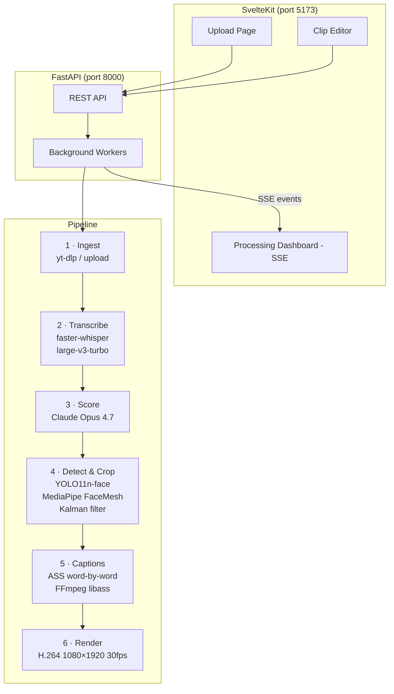

# ShortSmith

Self-hosted YouTube Shorts generator. Upload a long-form video (or paste a YouTube URL) → get 5–15 AI-scored, vertically-cropped, captioned clips ready to post.

No accounts. No subscriptions. No cloud except the Anthropic API.

---

## Architecture



---

## Requirements

- Python 3.10–3.12 (not 3.13 — mediapipe constraint)
- Node.js 18+
- FFmpeg 6+ with libass (`apt install ffmpeg` or `brew install ffmpeg`)
- `libgl1` on headless Linux: `apt install libgl1`
- GPU optional but strongly recommended for transcription speed

---

## Setup

```bash
# 1. Clone and enter
cd shortsmith

# 2. Create .env
cp .env.example .env
# Edit .env and set ANTHROPIC_API_KEY=sk-ant-...

# 3. Install everything
make install

# 4. Run (two terminals, or use make dev for both at once)
make run-backend   # terminal 1
make run-frontend  # terminal 2

# Open http://localhost:5173
```

---

## Quick test (POC script — no UI needed)

```bash
# Download a sample video first
yt-dlp "https://www.youtube.com/watch?v=..." -o sample.mp4

# Run the pipeline on a 30-second segment starting at 60s
make poc VIDEO=sample.mp4 START=60 DUR=30

# Output: poc_output.mp4 + frames/ directory for visual verification
```

---

## Configuration

### `.env` options
| Variable | Default | Description |
|----------|---------|-------------|
| `ANTHROPIC_API_KEY` | *(required)* | Your Anthropic API key |
| `WHISPER_MODEL` | `large-v3-turbo` | Whisper model (`large-v3` for better non-English) |
| `WHISPER_DEVICE` | `auto` | `cuda`, `cpu`, or `auto` |
| `USE_WHISPERX` | `false` | Enable forced alignment (`pip install shortsmith[whisperx]`) |
| `FFMPEG_HW_ACCEL` | `auto` | `nvenc`, `videotoolbox`, `none`, or `auto` |
| `CLAUDE_MODEL` | `claude-opus-4-7` | Claude model for scoring |

### `caption_config.json`
Edit this file to change caption appearance:
```json
{
  "font_family": "Arial Black",
  "font_size": 90,
  "primary_color": "#FFFFFF",
  "highlight_color": "#FFFF00",
  "outline_width": 3,
  "position_y_ratio": 0.65
}
```

---

## Troubleshooting

**`ImportError: libGL.so.1`**
```bash
apt install libgl1
```

**`CUDA out of memory` on transcription**
Set `WHISPER_MODEL=large-v3-turbo` and `WHISPER_COMPUTE_TYPE=int8_float16` in `.env`.

**Captions drift / out of sync**
Enable whisperX forced alignment: `USE_WHISPERX=true` in `.env`, then `make install-whisperx`.

**Face crop is jittery**
Tune Kalman filter in `backend/services/detect.py`:
- Increase `Q` (process noise) → more responsive to movement
- Increase `R` (measurement noise) → smoother but laggy on fast movement
- Default: Q=0.01, R=10

**yt-dlp fails with age-restricted videos**
Add cookies to yt-dlp: set `YTDLP_COOKIEFILE=/path/to/cookies.txt` and update `ingest.py` to pass `--cookies`.

---

## What I'd improve with another week

1. **whisperX by default** — the word alignment improvement is meaningful for fast speakers; the setup cost is worth it
2. **Dynamic crop filter** — the current implementation uses a static midpoint crop; a proper `sendcmd` filter would animate the crop position per-frame for smooth panning
3. **Re-score individual clips** — let users tweak start/end and hit "Re-score with Claude" to get a fresh hook_line and title for the edited window
4. **Caption preset gallery** — ship 5 style presets (minimal white, bold yellow, green karaoke, etc.) switchable from the mini-editor
5. **Speaker diarization** — use pyannote.audio to label speakers, then sync crop to the current speaker automatically even during A/B cuts
6. **Batch job history** — persistent job list on the home page so you can come back to old sessions
